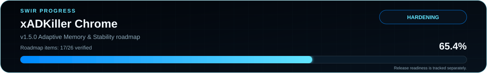

<!-- SWIR-README-STANDARD:v2 -->

<div align="center">


<br>


</div>

# xADKiller — Chrome development line

xADKiller is a privacy-focused Chrome Manifest V3 blocker maintained by **SWIR**. The current `chrome-v150-adaptive-memory` branch develops the next Chrome line while the Chrome Web Store baseline remains isolated on `main`.

[**Highlights**](#-highlights) · [**Quick Start**](#-quick-start) · [**Architecture**](#-architecture) · [**Roadmap**](#-roadmap--progress) · [**Security**](#-security--limitations)

## 📌 Project status



| Item | Status |
|---|---|
| Current stage | Development / hardening |
| Development branch | `chrome-v150-adaptive-memory` |
| Stable store baseline | v1.4.0 TITAN on `main` |
| Chrome requirement | Chrome 121+ |
| Verified development progress | **80.8% — 21/26 roadmap items** |
| Release readiness | **BLOCKED** — remaining hardening + manual browser validation |

The roadmap percentage measures implemented development work. It is **not** ad-blocking effectiveness and it does not mean the release gate has passed.

## ⚡ Highlights

| Feature | What it does |
|---|---|
| Declarative blocking | Uses Manifest V3 DNR rule sets for fast STANDARD, ULTRA and TITAN protection layers. |
| Adaptive Memory | Learns only high-confidence tracker/ad hosts locally, with bounded storage, TTL cleanup and reset control. |
| Breakage Guard | Provides temporary per-site recovery without immediately disabling the core protection stack. |
| Cross-layer rule dedupe | Deterministically removes equivalent protection rules across STANDARD/ULTRA static layers, packaged dynamic intelligence and TITAN session rules, with a CI regression gate. |
| Feed Guard | Validates approved GitHub protection feeds, schema, age, size, anti-shrink and anti-replay/downgrade invariants before new data can replace a known-good cache. |
| Data-only updates | Live Shield, Live Matrix and TITAN feeds contain rules/signatures only; executable logic stays inside the packaged extension. |
| Offline fallback | A failed, malformed or unavailable live feed falls back to the last validated cached protection data; transient GitHub/network failures use bounded local retry backoff instead of repeated fetches. |
| PL / EN UI | Maintained popup controls and diagnostics are available in Polish and English. |
| No-COMPAT active line | The development build does not enable the legacy COMPAT allow-rules layer. |
| Reproducible gates | CI exercises Chromium runtime, cross-layer dedupe, Shadow DOM, real-page soak, performance, feed integrity/offline fallback, breakage and blocking benchmarks. |

## 🚀 Quick Start

Development build from source:

```bash
git clone https://github.com/Swir/xADKiller.git
cd xADKiller
git switch chrome-v150-adaptive-memory
cd browser-extension
npm install --no-audit --no-fund
npm run build
```

Then open `chrome://extensions`, enable **Developer mode**, choose **Load unpacked**, and select:

```text
browser-extension/dist/chrome
```

The development branch is for testing. Do not treat it as the Chrome Web Store release until the release gate is explicitly completed.

## ✅ Verification

Useful local gates:

```bash
cd browser-extension
npm run validate
npm run test:layer-dedupe
npm run test:feeds
npm run test:feed-v2-consumers
npm run test:feed-checksums
npm run test:benchmark
```

The GitHub workflow additionally installs Chromium and runs the full runtime, Shadow DOM, real-page, performance, PL/EN, Adaptive Memory and Breakage Guard suite before producing the tested development ZIP.

## 🧩 Architecture

```text
Packaged extension code
├── DNR static rules: STANDARD / ULTRA / TITAN Boost
├── deterministic static ↔ dynamic ↔ session dedupe
├── session + dynamic protection
├── Adaptive Memory
├── Breakage Guard
└── Feed Guard
      ↓ validates data only
Approved GitHub feeds
├── Live Shield
├── Live Matrix
└── TITAN signatures
      ↓
validated cache / safe fallback
```

The live feed path is intentionally separated from executable logic. Remote JavaScript, Wasm or other executable payloads are not part of the feed update model.

## 🗺 Roadmap & progress

The authoritative Chrome roadmap is [`browser-extension/ROADMAP_CHROME.md`](browser-extension/ROADMAP_CHROME.md).

Current verified scope: **21 / 26 = 80.8%**. Release readiness remains **BLOCKED** until all remaining functional/performance work and manual browser regression testing are satisfactory.

## 📦 Releases

- **Chrome Web Store baseline:** v1.4.0 TITAN is the stable store line represented on `main`.
- **v1.5.0:** not released. The development branch may generate tested CI artifacts, but they are not a public release.

No merge to `main` or store update is justified by a green build alone.

## 🔐 Security & limitations

- No remote executable code in the live protection-feed mechanism.
- No telemetry backend is required for Adaptive Memory or Breakage Guard.
- Feed corruption/network failure must not replace the last validated cache.
- Transient feed transport failures use bounded local backoff, while schema/data validation failures remain immediately retryable so corrected protection data is not artificially delayed.
- Cross-layer dedupe removes semantically equivalent generated rules but does not replace functional browsing/regression testing.
- DNS/URL/content heuristics can produce false positives, so recovery controls and regression fixtures are part of the release gate.
- Deterministic benchmark scores describe the repository's fixed fixtures, not every advertisement or website on the Internet.
- Chrome platform limits and site behavior can change; support claims are kept to behavior verified by the current tests and manifest.

## 🔎 Search Keywords

`chrome ad blocker` • `manifest v3 ad blocker` • `privacy chrome extension` • `tracker blocker chrome` • `declarative net request` • `MV3 content blocker` • `adaptive ad blocking` • `anti tracking extension` • `Chrome Web Store extension` • `adblock PL EN` • `privacy protection extension` • `data only filter updates` • `GitHub filter feeds` • `xADKiller` • `SWIR`

<div align="center">

### `BLOCK • VERIFY • HARDEN • EVOLVE`

⭐ **If this project is useful, consider leaving a star.**

[**← SWIR profile**](https://github.com/Swir) · [**All projects →**](https://github.com/Swir?tab=repositories)

</div>