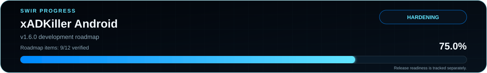

<!-- SWIR-README-STANDARD:v2 -->

<div align="center">


</div>

# xADKiller Android

**xADKiller by SWIR** is a privacy-first Android ad and tracker blocker that works without root. It uses Android `VpnService` only to capture DNS traffic locally; allowed DNS queries are forwarded directly to selected upstream DNS resolvers instead of through a remote xADKiller VPN server.

## Project status



**Development progress:** **66.7% — 8/12 verified v1.6 development items.**  
**Release readiness:** **BLOCKED** — automated CI is green, but physical-device VPN lifecycle, Wi-Fi/mobile transitions, sleep/wake, real-app behavior and longer stability validation are still required.

| Item | Status |
|---|---|
| Current development track | `android-v160-mega` / v1.6.0-dev |
| Latest public Android release | `v1.5.1` |
| Minimum Android SDK | API 26 |
| Target SDK | API 35 |
| Current deterministic DNS fixture | 127/127 blocked; 0/20 benign false positives |
| Authoritative roadmap | [`ANDROID_V160_ROADMAP.md`](ANDROID_V160_ROADMAP.md) |

> The DNS fixture result measures that fixed test corpus. It is **not** a claim that xADKiller blocks 100% of advertisements on every app or website.

## Highlights

| Feature | What it does |
|---|---|
| 🛡️ Local DNS filtering | Blocks known advertising, tracking and malicious domains device-wide without root. |
| 🔒 Local VPN architecture | Routes only the virtual DNS path needed by the filter; xADKiller does not operate a remote VPN relay. |
| 💓 VPN liveness heartbeat | Refreshes local service/UI liveness every 5 seconds even when no DNS packets are flowing, while still shutting the heartbeat down with the VPN lifecycle. |
| ⚡ STANDARD / ULTRA lists | Uses maintained public blocklists plus a bundled offline starter list and user rules. |
| 🧠 Adaptive DNS upstream pool | Tracks aggregate resolver latency/failures, uses bounded half-open recovery probes, caps the single provider-wide outage emergency attempt to 1200 ms, ages stale latency-only penalties, and starts each newly established VPN session with a fresh RTT/slow-response epoch while preserving failure/cooldown evidence. |
| 🔎 Private DNS diagnostics | Distinguishes strict Private DNS conflicts, active encrypted system DNS, automatic/unknown states and no-network states without pretending that per-app DoH can be detected. |
| ♻️ Safe list updates | Keeps a known-good cache, rejects obviously incomplete updates and uses rollback-safe replacement. |
| 🎛️ Custom allow/block rules | Lets the owner recover false positives or add local rules. |
| 📋 Local diagnostics | Stores blocking and system diagnostics on the device; no cloud log upload is required. |
| 🤖 Smart Ad Engine | Optional accessibility-based UI assistance is provided separately from DNS filtering. |

## Privacy and security

- no account is required;
- no advertising or analytics SDK is required for protection;
- local protection state is excluded from Android backup in the v1.6 development line;
- cleartext network traffic is disabled by manifest/network-security policy;
- DNS hostnames may be visible to the local filter, but HTTPS URL paths and page contents are not available to DNS filtering;
- the app does not install a TLS man-in-the-middle certificate;
- the development gate rejects `QUERY_ALL_PACKAGES`;
- app-level encrypted DNS/DoH is explicitly reported as **not reliably detectable** from Android system Private DNS APIs instead of being falsely classified.

Allowed DNS queries are forwarded to the configured public upstream pool: Cloudflare (`1.1.1.1`), Quad9 (`9.9.9.9`) and Google DNS (`8.8.8.8`).

## Quick start

### Public Android release

Use the latest verified Android asset from the repository's **Releases** page. The current public Android release is `v1.5.1`.

### Build v1.6.0-dev from source

Requirements: JDK 17, Android SDK 35/build-tools 35.0.0 and Gradle 8.9.

```bash
gradle --no-daemon lintDebug
gradle --no-daemon testDebugUnitTest
gradle --no-daemon assembleDebug
```

Development APK output:

```text
app/build/outputs/apk/debug/app-debug.apk
```

The branch CI additionally validates the manifest, APK archive integrity and SHA-256 checksum.

## Architecture

| Layer | Responsibility |
|---|---|
| `AdBlockVpnServiceV121` | Local TUN lifecycle, DNS query processing/forwarding, traffic-independent liveness heartbeat, fresh resolver-latency epoch on VPN establishment and runtime status. |
| `DnsPacket` | Strict IPv4/UDP/DNS parsing and upstream response validation. |
| `DnsUpstreamPool` | Resolver health scoring, network-epoch latency reset, stale-latency aging, cooldown, bounded half-open recovery and a 1200 ms all-provider emergency attempt while preserving failure evidence. |
| `BlocklistManager` | Offline bootstrap, remote list parsing/cache, user rules and memory-bounded hashed lookup. |
| `PrivateDnsHelper` + `DnsPrivacyDiagnostics` | System Private DNS inspection plus testable conflict/risk classification; per-app DoH is deliberately not claimed as detectable. |
| `SystemLogStore` / `LogStore` | Local diagnostics and blocking records. |

## Limitations

DNS filtering cannot reliably remove ads served from the same hostname as wanted content. Applications that use their own encrypted DNS/DoH path can bypass ordinary DNS interception, and Android's system Private DNS APIs cannot reliably identify that behavior per app. Per-app attribution depends on Android platform support. The fresh resolver-latency epoch is applied when the VPN protection session is established; physical-device Wi-Fi ↔ mobile handover behavior still requires the manual lifecycle gate. The v1.6.0 development branch is **not release-ready** until the manual-device lifecycle/stability gate is completed, including physical validation of the heartbeat across idle, sleep/wake and network transitions.

## Development roadmap

The Android v1.6.0 hardening plan is maintained in [`ANDROID_V160_ROADMAP.md`](ANDROID_V160_ROADMAP.md). Development completion and release readiness are deliberately tracked separately.

The SWIR progress graphics are generated deterministically from the authoritative roadmap by:

```bash
python3 ci/progress_svg.py android
python3 ci/progress_svg.py android --check
```

The Android v1.6 roadmap defines a finite 12-item development denominator. The generator derives the current **8/12 = 66.7%** directly from that checklist; the large-list/ANR item is now backed by the exact-head constrained-heap 750k-domain gate, while release readiness remains a separate physical-device/manual gate.

## 🔎 Search Keywords

`android ad blocker` • `android DNS blocker` • `local VPN ad blocker` • `tracker blocker Android` • `no root ad blocker` • `privacy DNS filter` • `Android VpnService DNS` • `malicious domain blocker` • `offline blocklist Android` • `DNS filtering app` • `Private DNS diagnostics` • `DoH compatibility Android` • `SWIR xADKiller` • `Android privacy tool`

<div align="center">

### `BLOCK • TEST • HARDEN • EVOLVE`

⭐ **If xADKiller is useful, consider leaving a star.**

[**← SWIR profile**](https://github.com/Swir) · [**All projects →**](https://github.com/Swir?tab=repositories)

</div>
