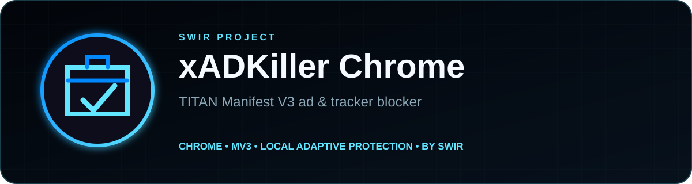

<!-- SWIR-README-STANDARD:v2 -->

<div align="center">



</div>

# xADKiller Chrome

**xADKiller Chrome by SWIR** is a Manifest V3 ad and tracker blocker built around declarative network rules, local cosmetic protection and privacy-preserving adaptive layers. The published Chrome line remains stable while v1.5.0 is hardened on a separate development branch.

## Project status


**Development progress:** **80.8% — 21/26 verified v1.5.0 roadmap items.**  
**Release readiness:** **BLOCKED** — manual browser/beta validation and the remaining hardening items are not complete.

| Item | Status |
|---|---|
| Stable Chrome baseline | `v1.4.0 TITAN` |
| Development track | `chrome-v150-adaptive-memory` / v1.5.0-dev |
| UI languages maintained in v1.5 | English / Polish |
| Remote executable code | None |
| COMPAT allow-rules layer | Removed from active Chrome architecture |
| Deterministic benchmark | STANDARD 49/49; ULTRA 49/49; benign controls 0/16 |
| Authoritative roadmap | [`ROADMAP_CHROME.md`](ROADMAP_CHROME.md) |

> Benchmark scores describe the fixed regression corpus used by this repository. They are **not** a promise that every advertisement on every website will be blocked.

## Protection layers

| Layer | What it does |
|---|---|
| 🛡️ DeclarativeNetRequest | Uses Manifest V3 static, dynamic and session rules for network blocking. |
| ⚡ STANDARD / ULTRA | Provides conservative and stronger protection modes with separately tested rule budgets. |
| 🎯 Source-quality ranking | Ranks STANDARD static candidates with deterministic source agreement plus useful request-type coverage, while preserving per-source contribution budgets and recording the quality model in build metadata. |
| ♻️ Cross-layer dedupe | Removes semantically equivalent rules across STANDARD/ULTRA static data, packaged dynamic intelligence and TITAN session rules, then re-checks zero overlap in CI. |
| 📊 Rule Budget | Shows live packaged STANDARD/ULTRA/TITAN Boost counts plus current runtime rule buckets without inventing a browser-limit percentage. |
| 🧠 TITAN Adaptive Memory | Persists only promoted high-confidence third-party ad/tracker hosts, with TTL, bounds and a user reset. |
| 🧩 Smart DOM / Shadow protection | Hides ad containers in normal, open-shadow and closed-shadow DOM while protecting normal page UI. |
| ⏭️ Smart Auto-Skip | Handles explicit ad-skip controls conservatively. |
| 🩹 Breakage Guard | Uses a two-stage recovery path: first pause only local heuristic/cosmetic/learning layers while core DNR stays enabled, then offer the existing full temporary site pause only when needed. Recovery events stay in a bounded local history that the user can clear; no telemetry is sent. |
| 🌐 Live Shield / Live Matrix / TITAN feed | Pulls verified **data-only** protection rules/signatures from the official GitHub repository. |
| 🔐 Feed Guard | Rejects malformed, stale, future-dated, undersized or suspiciously shrunken data feeds and preserves known-good cache fallback. |
| 📐 Performance budget | Runs a reproducible Chromium regression gate for service-worker readiness, mutation injection, protection settling, renderer responsiveness and page-heap ceilings. |

## GitHub protection-data updates

The extension intentionally separates executable logic from remotely refreshed protection data:

- executable JavaScript ships inside the extension package;
- approved GitHub endpoints provide only domains, URL signatures, cosmetic selectors and regex/rule metadata;
- Feed Guard validates schema/age/shape before data can replace a known-good cache;
- `browser-intelligence/feed-checksums.json` pins the exact Git blob hashes and metadata of the production Live Shield, Live Matrix and TITAN feeds, and CI re-fetches and verifies those payloads;
- a network outage or bad feed must not require remote code or disable the last valid cached protection;
- the development CI contains explicit no-remote-code and no-COMPAT safety gates.

The feed checksum manifest is an integrity/audit gate, not a remote-code loader and not a claim of signed distribution.

## Build

```bash
npm install --no-audit --no-fund
npm run build
npm run validate
```

Chrome/Chromium development output:

```text
dist/chrome
```

Load it locally from `chrome://extensions` → **Developer mode** → **Load unpacked**.

## Test gate

The v1.5 branch runs Chromium and integrity gates for:

- TITAN runtime behavior;
- deterministic source-agreement/resource-coverage ranking of STANDARD static rules with per-source contribution budgets;
- deterministic semantic cross-layer dedupe across static, dynamic and session rule outputs;
- Shadow DOM mutation soak;
- broader real-page mutation soak with normal business UI, login/checkout/media controls and mixed DOM/Shadow ad layers;
- reproducible startup/DOM/renderer/heap performance ceilings designed to catch regressions rather than advertise benchmark speed;
- static/adaptive boost behavior;
- no-COMPAT regression;
- PL/EN language persistence plus populated Rule Budget diagnostics;
- Adaptive Memory persistence/privacy/reset;
- two-stage Breakage Guard: heuristic-only recovery keeps core DNR active, restores normal/open/closed Shadow DOM elements, preserves login/checkout/media UI, records only bounded local recovery events and still verifies full temporary pause/resume as the escalation path;
- GitHub Feed Guard validation and local health diagnostics;
- deterministic production-feed checksum/metadata verification against the exact GitHub payloads;
- deterministic blocking effectiveness;
- ZIP integrity and SHA-256 checks.

Progress graphics are regenerated and checked from the authoritative roadmap with:

```bash
python3 ../ci/progress_svg.py chrome
python3 ../ci/progress_svg.py chrome --check
```

## Privacy

xADKiller stores settings and adaptive protection state locally in the browser profile. The v1.5 Adaptive Memory design intentionally avoids persisting full page URLs, request paths or originating browsing-history domains. Breakage Guard stores only a bounded local site-recovery event history for user-visible rollback diagnostics and offers a local clear control; there is no recovery telemetry. There is no xADKiller advertising telemetry/profile backend and no remote executable code.

See [`PRIVACY.md`](PRIVACY.md) for the store-facing privacy policy.

## Chrome Web Store / releases

The current stable source/release baseline is **xADKiller Chrome v1.4.0 — TITAN**. v1.5.0-dev artifacts are CI development packages only and are **not** merged into `main` or published as the next store update until the remaining release gate passes.

Firefox-related source remains secondary/later work; the active release target in this roadmap is Chrome/Chromium.

## Limitations

No blocker can guarantee universal ad removal. Same-origin advertising, first-party delivery, frequently changing markup and site-specific anti-blocking behavior can require new verified rules. Aggressive filtering can also break legitimate functionality, which is why Breakage Guard and false-positive regression tests are part of the v1.5 hardening plan.

## 🔎 Search Keywords

`Chrome ad blocker` • `Manifest V3 ad blocker` • `Chrome tracker blocker` • `privacy browser extension` • `declarativeNetRequest blocker` • `MV3 content blocker` • `Shadow DOM ad blocker` • `adaptive ad blocking` • `local ad blocker` • `GitHub filter updates` • `tracker protection extension` • `SWIR xADKiller`

<div align="center">

### `BLOCK • VERIFY • HARDEN • EVOLVE`

⭐ **If xADKiller is useful, consider leaving a star.**

[**← SWIR profile**](https://github.com/Swir) · [**All projects →**](https://github.com/Swir?tab=repositories)

</div>
